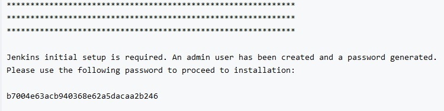
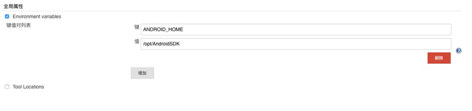
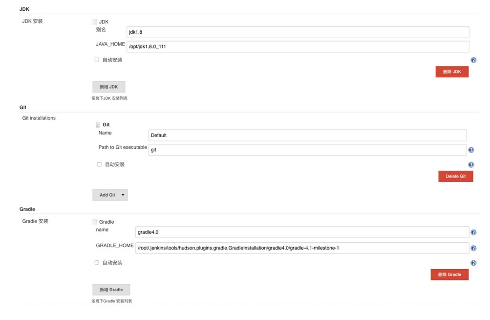
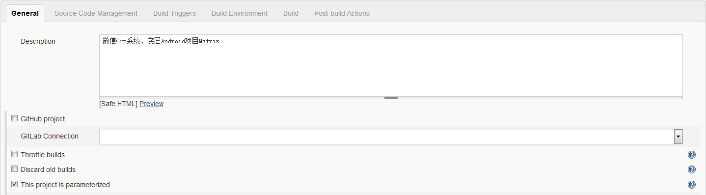
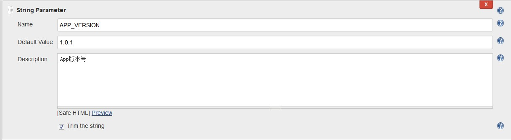
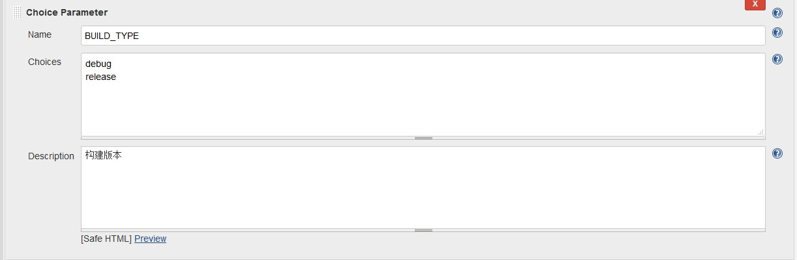
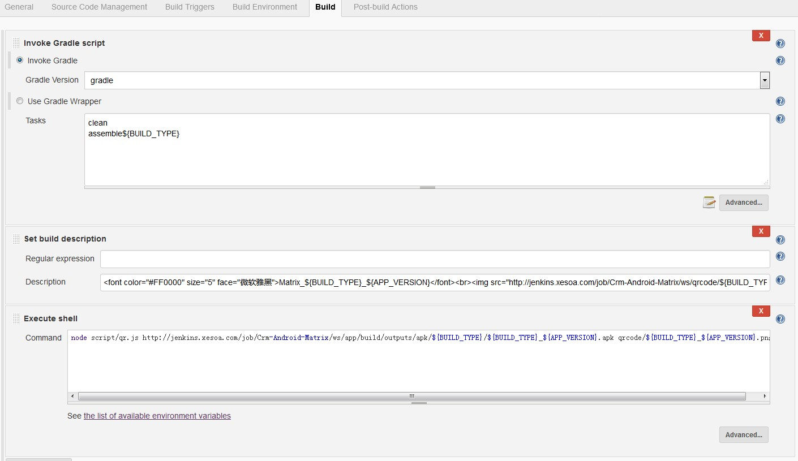
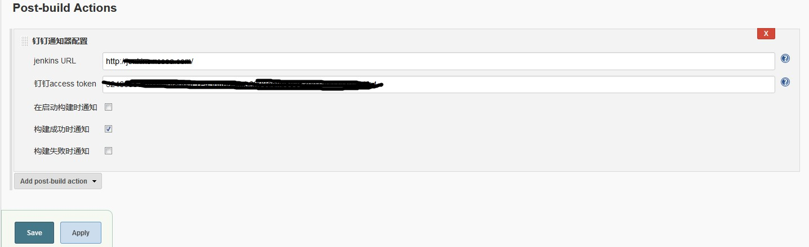
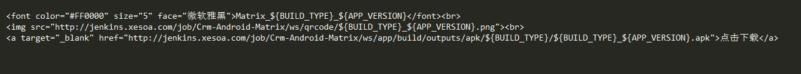

# Jenkins + Android + Gradle

## Jenkins下载安装

* 下载地址: https://jenkins.io
* 安装流程： 略（参照网上方案：https://blog.csdn.net/ncepudmx/article/details/77451314）

## Jenkins环境配置

* 初始化

    1. Jenkins在首次运行时生成的，会在控制台打印出来或者按照页面提示的文件路径查看管理员密码。

    

    2. 插件安装，建议自己选择要安装的插件，不选择Jenkins建议安装的插件。点击Select plugins to
       install进入下一个页面。Android打包一般装的插件：

       - Git plugin
       - Gradle Plugin
       - Email Extension Plugin
       - description setter plugin
       - build-name-setter
       - user build vars plugin
       - Post-Build Script Plug-in
       - Branch API Plugin
       - SSH plugin
       - Scriptler
       - Git Parameter Plug-In
       - Gitlab plugin

* 环境配置

    1. 需要配置的环境变量有Android Home、JDK目录、Gradle目录。首先点击系统管理=>系统设置，
       选中Environment variables，然后新增Android Home环境变量

        

    2. 然后在系统管理=>Global Tool Configuration中配置JDK目录和Gradle目录

        

       **JDK和Gradle建议提前下载好放到服务器上，不要使用自动安装，Jenkins自动下载安装
       非常慢**

## 创建Job

* 在Jenkins中点击新建，输入Job名字，由于Jenkins会根据Job名字生成目录所以建议使用英文不要使用
  中文，然后选择构建一个自由风格的软件项目，然后点击OK进入配置页面

    1. 描述：

        

    2. 参数配置：勾选 This project is parameterized

        1. 版本号：

            

        2. Git配置:

            

        3. BUILD_TYPE:

            
            

        4. 区分本地打包还是Jenkins打包

            

        5. 代码源

            

        6. Git代码Tag

            

        7. build

            

        8. DingDing

            

        **备注：**

        1. 样式：

            

        2. node script/qr.js http://jenkins.xesoa.com/job/Crm-Android-Matrix/ws/app/build/outputs/apk/${BUILD_TYPE}/${BUILD_TYPE}_${APP_VERSION}.apk qrcode/${BUILD_TYPE}_${APP_VERSION}.png
